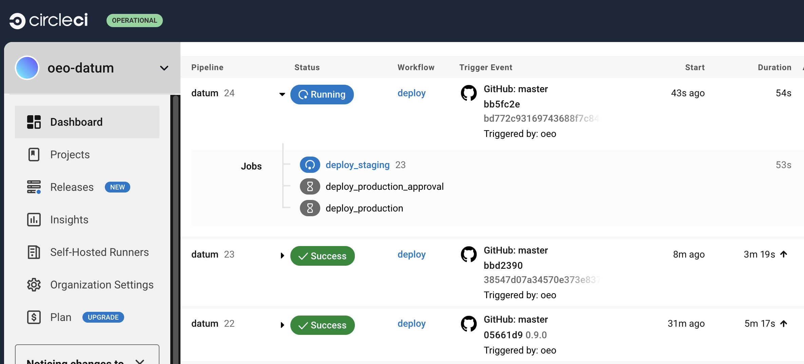
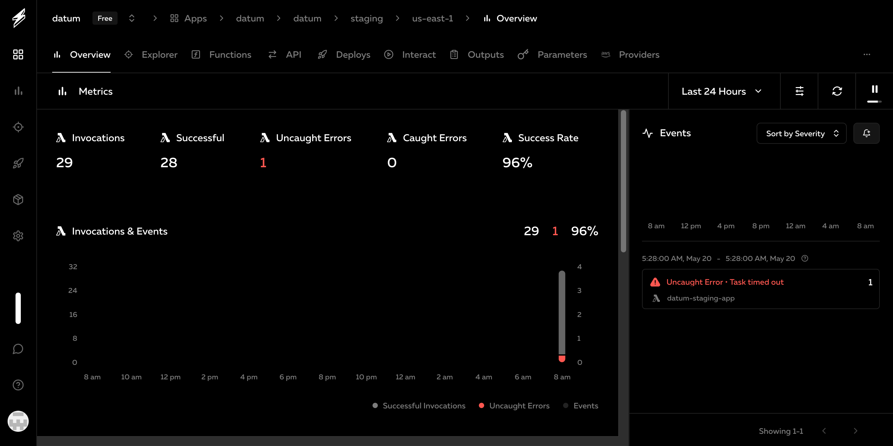

<p>
  
</p>

# datum
`datum` is a Node.js framework that improves API development, focusing on complete automatic REST API exposure from Mongoose models.
The framework favors a heavily opinionated design pattern that encourages placing more complex logic into model methods and statics combined
with libraries. This increases protoyping and MVP speed while also providing an intuitive pattern
that is easy to pick up on.

In contrast to MVC, where you would typically place your logic in Controllers,
this framework is considered Model/Library/Route (MLR). With the R being optional.

Where logic doesn't fit in the context of a model method or static, you can expose a method within a custom route, which somewhat acts like
a typical controller, having access to both libraries and all models to work from.

## Production ready
- Has provided deployment scripting for [Serverless](https://www.serverless.org) and [CircleCI](https://www.circleci.com).
- Scaled deployments in Serverless environments handling well over 25k reqs/sec.
- Powers multiple incredibly high volume ecommerce companies in production.
- Supports staging as well as production instances with unique properties and environments.
- Supports continuous integration which can automatically deploy Serverless staging on master push.

## Why it's great
- It makes creating complex API backends _fast_.
- Automatic CRUD generation for ORM models.
- Automatic model method and static route/endpoint generation (see below).
- It runs perfect locally then deploys to Serverless costing you nothing for your company to run.
- No database management or migration scripts to deal with.
- Flexible middleware `res.respond()` offering responses in JSON, pretty JSON, JSONP, or XML
- And more.

## Stack
- Node JS (Coffeescript2 ES6)
- Redis
- MongoDB

## Quick start

The project has a minimal amount of prereqs which you probably already have installed.

1. NVM [nvm-sh/nvm](https://github.com/nvm-sh/nvm)
1. Redis
1. MongoDB

```bash
git clone https://github.com/oeo/datum
cd ./datum
nvm install
nvm use
npm install -g yarn
yarn
yarn dev
```

By default the local http server will attempt to listen on port 8000.
You can modify the `.env` file to change this port for local development.

<p>
  
</p>

### CRUD

#### Listing all items

Simply request `GET /events` to get a paginated list of documents stored.

You can utilize options to paginate over the data like this: `GET /events?limit=5&page=3`

This will yield an expected result, like this:

```javascript
{
  "ok": true,
  "response": {
    "total": 201,
    "pages": {
      "labelIndexMin": 15,
      "labelIndexMax": 20,
      "offset": 15,
      "page": 3,
      "pageLabel": 4,
      "pageTotalLabel": 41,
      "total": 201,
      "links": [
        {
          "pageNum": 2,
          "label": 3,
          "minOffset": 10,
          "maxOffset": 15,
          "prev": true
        },
        {
          "pageNum": 4,
          "label": 5,
          "minOffset": 20,
          "maxOffset": 25,
          "next": true
        }
      ],
      "hasItems": true
    },
    "items": [
      {
        "_id": "I67j6vPtl3",
        "event": "user_signup",
        "name": "Chris Miller",
        "mtime": 1716182212,
        "ctime": 1716182212,
        "__v": 0
      },
      //
      // ...
      //
      {
        "_id": "VpgJiQBo81",
        "event": "user_login",
        "name": "Tom Joe",
        "mtime": 1716182212,
        "ctime": 1716182212,
        "__v": 0
      }
    ]
  },
  "_meta": {
    "path": "/events",
    "method": "GET",
    "query": {
      "limit": "5",
      "page": "3"
    },
    "filter": {},
    "elapsed": 10
  }
}
```

As you notice, the response provide useful information regarding how many 
total items exist in the data as well as pagination properties to allow you
to build a UX without much trouble.

It also provides some heurisitics that contain the request details and the elapsed
time duration it took the request to be processed. This is metadata is standard
for all responses that the project generates.

### Models and auto-expose

The Events model is included by default. It is located at `./models/events.coffee`.

```coffeescript
# this is the data structure for our event entity
Event = new Schema {

  event: {
    type: String
    required: true
  }

  player: {
    type: String
  }

}, modelOpts.schema

Event.plugin(basePlugin)

#
# this is an entity method, in datum the inputs for all
# model methods that you want to expose must be a single
# object which will respresent the entire object passed
# in the postdata from the browser.
#
Event.methods.changeEvent = ({ newEvent }) ->
  @event = newEvent

  try
    return await @save()
  catch e
    return e

#
# this is a static method, it doesn't manipulate any data
# but it will respond to you without whatever you place in
# the response string in your post data.
#
Event.statics.ping = ({ response }) ->
  return { pong: response }

#
# this code wraps the model so it can be exposed for rest
# consumption as it is loaded. you can also omit this, just
# export the model and it will be private for all requests
# and used only for internal purposes.
#
model = mongoose.model modelOpts.name, Event
module.exports = EXPOSE(model)
```

#### Creating a new document

You can create a new event object in two ways, one is traditional and the other is an http override,
which is handy for developing locally.

1. Traditional
  - Request `POST /events`
  - Body data: `{ "event": "user_signup", "name": "John Smith" }`

2. Query override method: `GET /events?method=post&event=user_signup&name=John+Smith`

#### Invoking model methods

In this example we'll call the `changeEvent` function over REST. 
`vBXYrWZyzf` respresents the document ID we want to change.

1. Traditional
  - Request `POST /events/vBXYrWZyzf/changeEvent`
  - Body data: `{ newEvent: 'very_unique_event' }`

2. Query override method: `GET /events/vBXYrWZyzf/changeEvent?method=post&newEvent=very_unique_event`

The response for this approach will be the modified document or an error if this change
somehow breaks the model validation rules.

```javascript
{
  "ok": true,
  "response": {
    "_id": "vBXYrWZyzf",
    "event": "very_unique_event",
    "name": "Chris Miller",
    "mtime": 1716183240,
    "ctime": 1716182212,
    "__v": 0
  },
  "_meta": {
    "path": "/events/vBXYrWZyzf/changeEvent",
    "method": "POST",
    "query": {},
    "body": {
      "method": "post",
      "newEvent": "very_unique_event"
    },
    "filter": {},
    "elapsed": 10
  }
}
```

#### Invoking model statics

1. Traditional
  - Request `POST /events/ping`
  - Body data: `{ pong: 'hello, world' }`

2. Query override method: `GET /events/ping?method=post&pong=Hello+World`

The response for this approach will be the return value, echoing the param
data that you provided in the `pong` data field.

```javascript
{
  "ok": true,
  "response": {
    "pong": "Hello, World"
  },
  "_meta": {
    "path": "/events/ping",
    "method": "POST",
    "query": {},
    "body": {
      "method": "post",
      "pong": "Hello, World"
    },
    "filter": {},
    "elapsed": 0
  }
}
```

## Deployment
<p>
  
</p>

Platform is integrated with CircleCI and allows for simple deployment over
the Serverless platform in a stage and production environment.

<p>
  
</p>

Some frameworks will allow you to have a Serverless deployed product but
it's a complete shitshow to run it locally as a result of the way it
was designed. That's not so with datum, you can run your application
natively and locally and even host it on a VPS or your own dedicated server
if you were inclined to do so.

---

## @todo
- [x] slightly more comprehensive readme
- [x] finish continous integration routine for serverless using cci
- [ ] implement queue/digestion abstraction for utilizing sqs
- [ ] robust authentication 
  - [ ] add ip whitelist bypass
  - [ ] api: key management/revoke
  - [ ] allow for passport/gsuite auth
- [ ] begin documentation
- [ ] implement a solid testing solution

---

## MIT

Permission is hereby granted, free of charge, to any person obtaining a copy of this software and associated documentation files (the "Software"), to deal in 
the Software without restriction, including without limitation the rights to use, copy, modify, merge, publish, distribute, sublicense, and/or sell copies of 
the Software, and to permit persons to whom the Software is furnished to do so, subject to the following conditions:

The above copyright notice and this permission and license should be included in all copies or substantial portions of the Software.

THE SOFTWARE IS PROVIDED "AS IS", WITHOUT WARRANTY OF ANY KIND, EXPRESS OR IMPLIED, INCLUDING BUT NOT LIMITED TO THE WARRANTIES OF MERCHANTABILITY, FITNESS FOR 
A PARTICULAR PURPOSE AND NONINFRINGEMENT. IN NO EVENT SHALL THE AUTHORS OR CONTRIBUTORS BE LIABLE FOR ANY CLAIM, DAMAGES OR OTHER LIABILITY, WHETHER OR NOT 
ADVISED OF THE POSSIBILITY OF SUCH DAMAGE.

